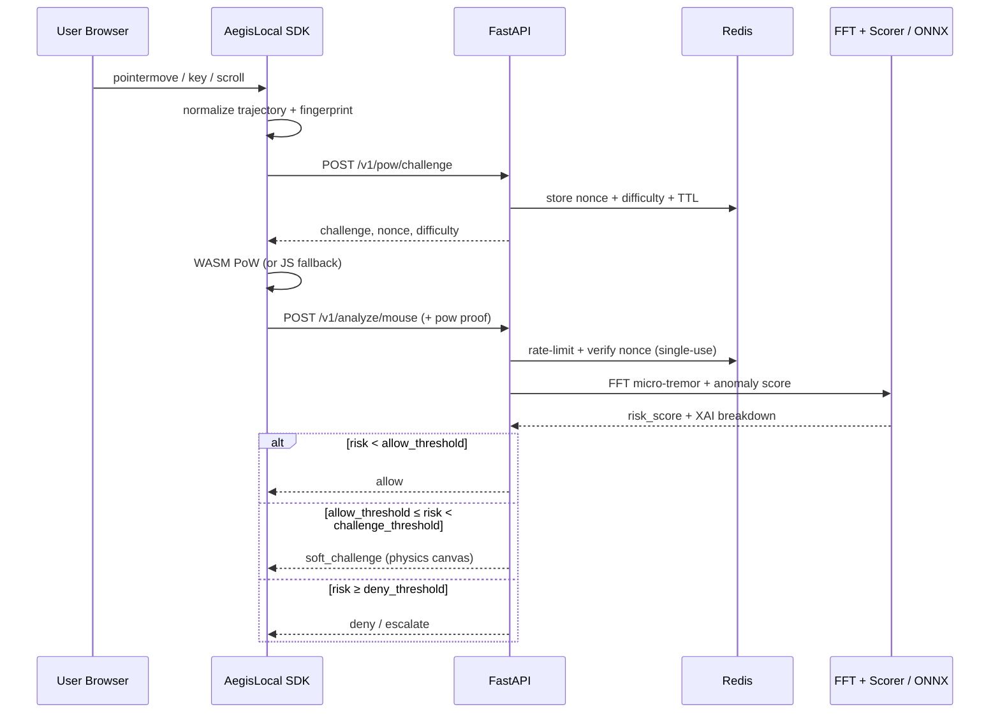

# AegisLocal — Sistem Mimarisi & Teknoloji Yığını

## 1. Tasarım İlkeleri

| İlke | Uygulama |
|------|----------|
| Veri egemenliği | Telemetri kurum dışına çıkmaz; üçüncü taraf CAPTCHA yok |
| Düşük sürtünme | Çoğu insan için sessiz geçiş; challenge yalnızca gri bölgede |
| Savunma derinliği | Telemetri → PoW → ML → Physics Canvas (sıralı eskalasyon) |
| Açıklanabilirlik | Her skor XAI breakdown ile gelir |
| Erişilebilirlik | WASM/JS PoW fallback + WCAG alternatif challenge |

## 2. Teknoloji Yığını

```
┌─────────────────────────────────────────────────────────────────┐
│  CLIENT                                                          │
│  TypeScript SDK (ESM) · PoW WASM (Rust) · JS PoW fallback       │
│  Physics Canvas (HTML5 Canvas 2D) · Fingerprint collectors       │
├─────────────────────────────────────────────────────────────────┤
│  EDGE / GATEWAY                                                  │
│  Nginx / Caddy · TLS · optional WAF headers                      │
├─────────────────────────────────────────────────────────────────┤
│  API LAYER                                                       │
│  Python 3.12 + FastAPI · Pydantic v2 · uvicorn                   │
│  (Go gateway opsiyonel Phase 5 için hot-path rate-limit)         │
├─────────────────────────────────────────────────────────────────┤
│  STATE                                                           │
│  Redis 7 — sliding-window rate limit, PoW nonce, session risk    │
│  PostgreSQL 16 — audit, model metadata, labeled samples          │
├─────────────────────────────────────────────────────────────────┤
│  ML                                                              │
│  NumPy/SciPy FFT · scikit-learn IsolationForest (train)          │
│  ONNX Runtime (local inference) · XAI risk matrix                │
├─────────────────────────────────────────────────────────────────┤
│  OPS                                                             │
│  Prometheus + Grafana · React ops dashboard · Docker Compose     │
└─────────────────────────────────────────────────────────────────┘
```

**Neden FastAPI (MVP):** FFT/ML ekosistemi Python-native; ONNX Runtime Python bindings olgun; hızlı prototip.  
**Neden Rust→WASM (PoW):** deterministik, sabit zamanlı hash döngüsü, <50ms hedef.  
**Neden Redis:** dağıtık botnet’e karşı sliding window + nonce single-use.

## 3. Directory Tree (Production-Ready)

```
AegisLocal/
├── README.md
├── docs/
│   ├── ARCHITECTURE.md
│   ├── ROADMAP.md
│   └── TEST_STRATEGY.md
├── client-sdk/                 # İstemci telemetri SDK
│   ├── package.json
│   ├── tsconfig.json
│   └── src/
│       ├── index.ts
│       ├── collectors/mouse.ts
│       ├── collectors/keyboard.ts
│       ├── collectors/fingerprint.ts
│       ├── pow/client.ts
│       ├── pow/jsFallback.ts
│       ├── normalize.ts
│       └── transport.ts
├── pow-wasm/                   # Rust PoW → WASM
│   ├── Cargo.toml
│   └── src/lib.rs
├── physics-canvas/             # HTML5 fizik challenge (Faz 4)
│   └── src/
├── backend/                    # FastAPI decision API
│   ├── requirements.txt
│   ├── app/
│   │   ├── main.py
│   │   ├── api/
│   │   │   ├── analyze.py
│   │   │   ├── pow.py
│   │   │   └── challenge.py
│   │   ├── core/
│   │   │   ├── config.py
│   │   │   └── redis_client.py
│   │   ├── ml/
│   │   │   ├── fft_features.py
│   │   │   ├── scoring.py
│   │   │   └── onnx_runtime.py
│   │   └── services/
│   │       ├── rate_limit.py
│   │       └── reputation.py
│   └── tests/
├── dashboard/                  # Ops / XAI görünürlük (Faz 5)
├── datasets/
│   ├── raw/
│   └── processed/
├── infra/
│   ├── docker/
│   │   └── docker-compose.yml
│   ├── prometheus/
│   └── grafana/
└── scripts/
    ├── demo.html
    ├── bot_playwright.py
    └── human_sim.py
```

## 4. Veri Akışı



## 5. Karar Eşikleri (MVP defaults)

| Skor bandı | Aksiyon |
|------------|---------|
| 0.00 – 0.35 | `allow` |
| 0.36 – 0.65 | `soft_challenge` (physics / a11y) |
| 0.66 – 1.00 | `deny` (+ rate-limit sertleştir) |

Eşikler `AEGIS_*` env ile override edilir; production’da A/B + drift izleme ile kalibre edilir.

## 6. Gizlilik / Uyumluluk Notları

- Ham fare noktaları varsayılan olarak **kalıcı saklanmaz**; yalnızca türetilmiş özellikler + skor audit’e yazılır (opt-in raw retention).
- IP reputation sorguları kurum politikasına bağlı; AbuseIPDB/MaxMind **opsiyonel** ve kapatılabilir.
- `navigator` / canvas fingerprint hash’leri tek yönlü; PII ile birleştirilmez.
